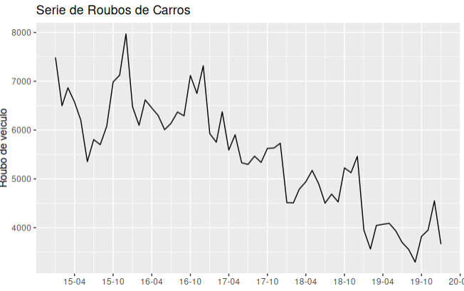
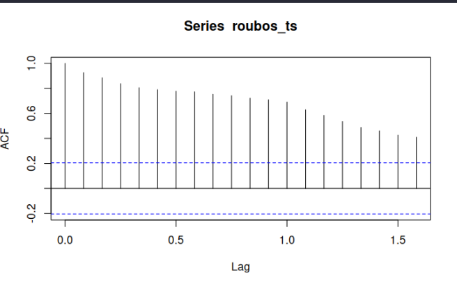
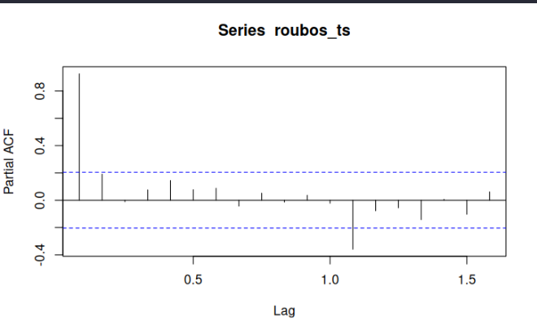
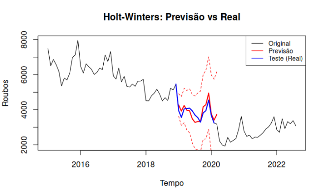

# Modelagem e Previsão de Séries Temporais de Roubos de Carro em SP

### Uma Comparação entre Holt-Winters e SARIMA

**Projeto Final - SME0808**
Universidade de São Paulo (USP) - ICMC

*Felipe C. Azambuja, Felipe C. Machado, Thales S. Queiroz*

---

# Agenda

1. Contextualização e Problema
2. O Desafio dos Dados
3. Objetivos
4. Fundamentação Teórica (Breve)
5. Análise Exploratória
6. **Resultados: Holt-Winters**
7. **Resultados: SARIMA**
8. Comparação e Conclusão

---

# 1. Contextualização

---

# A Importância da Segurança Pública

* **Tomada de Decisão Estratégica:** A análise de séries temporais permite prever picos de criminalidade.
* **Alocação de Recursos:** Otimização do policiamento preventivo baseada em dados.
* **Cenário:** Cidade de São Paulo.
* **Foco:** Ocorrências mensais de **roubos de veículos**.

> "Identificar períodos de alta é crucial para a gestão pública."

---

# O Problema

Estamos lidando com uma série temporal de contagem de roubos.

* **Janela de Observação:** 2015 a 2022.
* **Periodicidade:** Mensal.
* **Características Esperadas:**
    * Tendência (crescimento ou queda a longo prazo).
    * Sazonalidade (padrões que se repetem anualmente).

---

# 2. O Desafio dos Dados
## Tratando a Anomalia Exógena

---

# O Impacto da COVID-19

Durante a análise preliminar, identificou-se uma **quebra estrutural severa** entre 2020 e 2021.

* **Causa:** Pandemia e restrições de mobilidade.
* **Consequência:** Mudança drástica no padrão de roubos que não reflete a dinâmica natural do crime.
* **Decisão Metodológica:**
    * **Remoção do período da pandemia (2020-2021).**
    * Utilização da série histórica "limpa" para garantir estabilidade dos parâmetros.

---

# 3. Objetivos

## Geral
Comparar o desempenho preditivo entre modelos de suavização exponencial (**Holt-Winters**) e modelos estatísticos paramétricos (**SARIMA**).

## Específicos
1.  Caracterizar Tendência e Sazonalidade.
2.  Ajustar modelos Holt-Winters (Aditivo vs Multiplicativo).
3.  Estimar modelo SARIMA otimizado via AIC.
4.  Validar via métricas de erro (RMSE, MAPE) e análise de resíduos.

---

# 4. Fundamentação Teórica

Focaremos na aplicação de duas famílias de modelos:

1.  **Holt-Winters (Suavização Exponencial Tripla):**
    * Ideal para séries com tendência e sazonalidade.
    * Possui componentes de Nível ($L_t$), Tendência ($T_t$) e Sazonalidade ($S_t$).
    * Parâmetros de suavização: $\alpha, \beta, \gamma$.

2.  **SARIMA $(p,d,q)(P,D,Q)_s$:**
    * Modelagem das autocorrelações.
    * Inclui diferenciações sazonais e não sazonais.

---

# 5. Análise Exploratória e Visualização

---

# A Série Temporal (Comportamento)

* Observa-se claramente a presença de **sazonalidade** marcada.
* Existe uma tendência variável ao longo do tempo.
* A remoção da quebra estrutural permite visualizar melhor os ciclos "normais" da criminalidade.

---

# Decomposição da Série

A decomposição STL revela:

* **Trend:** O comportamento de longo prazo.
* **Seasonal:** Padrão repetitivo claro (anual).
* **Resid:** O ruído aleatório que o modelo deve tentar minimizar.

---

# Autocorrelação (ACF e PACF)

  
  

* **ACF:** Decaimento lento nos lags sazonais, confirmando a não-estacionariedade e forte sazonalidade.
* **PACF:** Ajuda na identificação da ordem dos modelos AR e MA.

---

# 6. Resultados: Holt-Winters

---

# Ajuste dos Modelos HW

Foram testadas duas abordagens: **Aditiva** e **Multiplicativa**.

| Método | MSE (Treino) | RMSE (Teste) | MAPE (Teste) |
| :--- | :---: | :---: | :---: |
| **Aditivo** | 81873 | **289** | **6.69%** |
| Multiplicativo | **64585** | 315 | 6.99% |

* O modelo **Aditivo** venceu no conjunto de teste.
* MAPE de **6.69%** indica alta precisão.

---

# Interpretação dos Parâmetros (Modelo Vencedor)

O modelo Holt-Winters Aditivo estimou:

* **$\alpha$ (Nível) = 0.78**: Alto. O modelo se adapta *rapidamente* a mudanças recentes no nível de crimes.
* **$\beta$ (Tendência) = 0.02**: Baixo. A inclinação da tendência é estável, sem mudanças bruscas de direção.
* **$\gamma$ (Sazonalidade) = 1.0**: Máximo. A sazonalidade é *altamente dinâmica*, baseando-se quase inteiramente no último ano observado.

---

# Performance Visual: Holt-Winters

**Linha Azul:** Dados Reais
**Linha Vermelha:** Previsão HW Aditivo

* Captura precisa dos picos e vales.
* Acompanha a tendência de queda/estabilização no final da série.

---

# Diagnóstico de Resíduos

A validação estatística é essencial.

1.  **Normalidade:** O histograma sugere distribuição normal dos erros.
2.  **Independência:**
    * Teste de **Ljung-Box**: p-valor = **0.3347**.
    * Como p > 0.05, não rejeitamos a hipótese nula.
    * **Conclusão:** Os resíduos são ruído branco (aleatórios).

---

# 7. Resultados: SARIMA

---

# Seleção do Modelo SARIMA

Utilizando o algoritmo `auto.arima` (critério AIC), o modelo selecionado foi:

$$SARIMA(0, 1, 1)(0, 1, 0)_{12}$$

* **$d=1, D=1$**: Necessidade de diferenciação simples e sazonal para estacionariedade.
* **$q=1$**: Componente de média móvel para correção de erros passados.
* **Termo Sazonal:** Estatisticamente relevante (coeficiente > 2x erro padrão).

---

# Performance do SARIMA

Apesar da robustez teórica, o SARIMA apresentou dificuldades com esta série específica.

* **MAPE (Teste):** 18.32%
* **RMSE:** 728

**Análise:** O modelo apresentou desempenho inferior ao Holt-Winters, possivelmente devido à complexidade exigida versus a quantidade de dados disponíveis após o corte da pandemia.

---

# 8. Conclusão e Comparação

---

# Comparativo Final

| Métrica | Holt-Winters (Aditivo) | SARIMA |
| :--- | :---: | :---: |
| **MAPE** | **6.69%** | 18.32% |
| **RMSE** | **289** | 728 |
| **Diagnóstico** | Resíduos Aleatórios | Indícios de Overfitting |

---

# Conclusões

1.  **Vencedor Claro:** O método de **Holt-Winters com Sazonalidade Aditiva** foi superior.
2.  **Robustez:** Métodos de suavização exponencial mostraram-se mais robustos e parcimoniosos para esta série, especialmente após o tratamento da quebra estrutural.
3.  **Natureza do Fenômeno:** A sazonalidade dos roubos de carros mostrou-se aditiva (amplitude constante) e dinâmica ($\gamma=1$).
4.  **Aplicabilidade:** O modelo final é seguro para previsões de curto prazo (12 meses) e apoio à decisão policial.

---

# Obrigado!

**Perguntas?**
